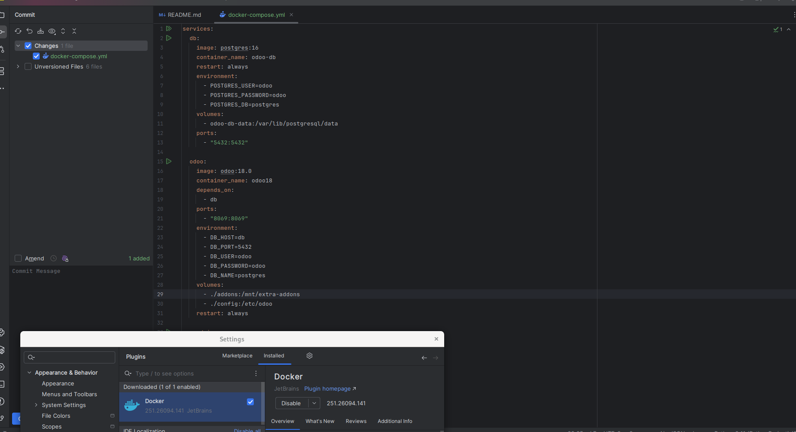
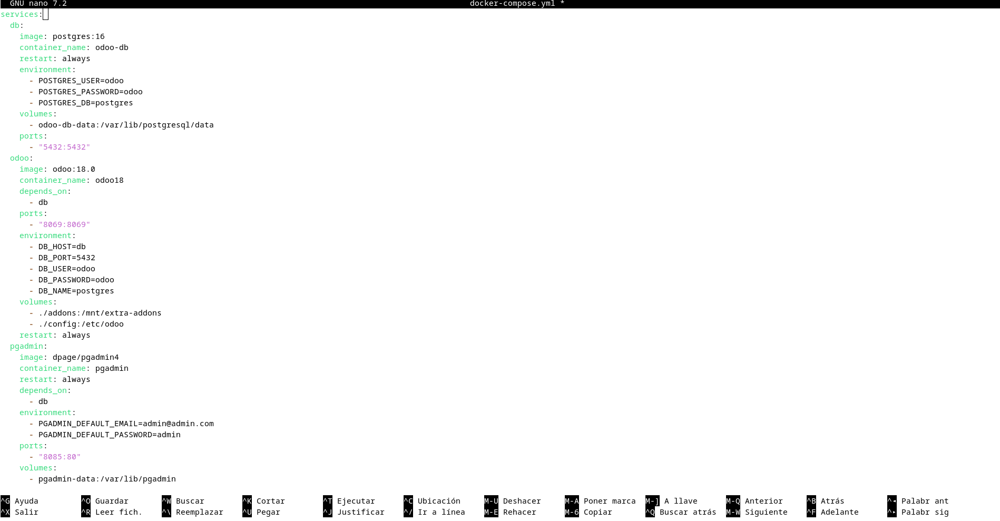
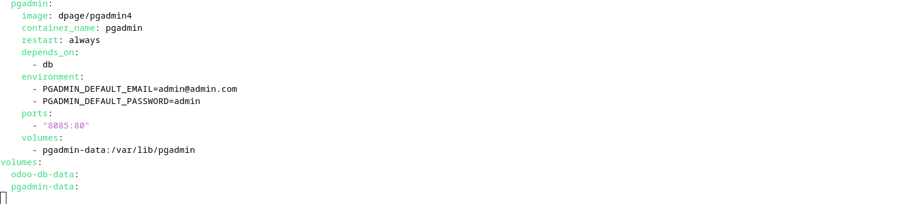
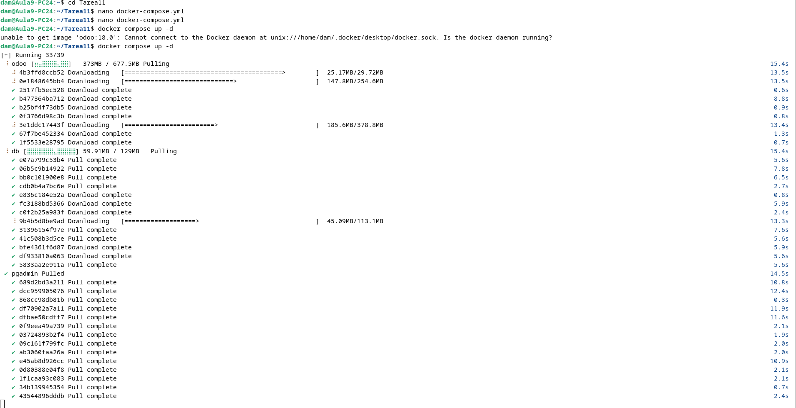
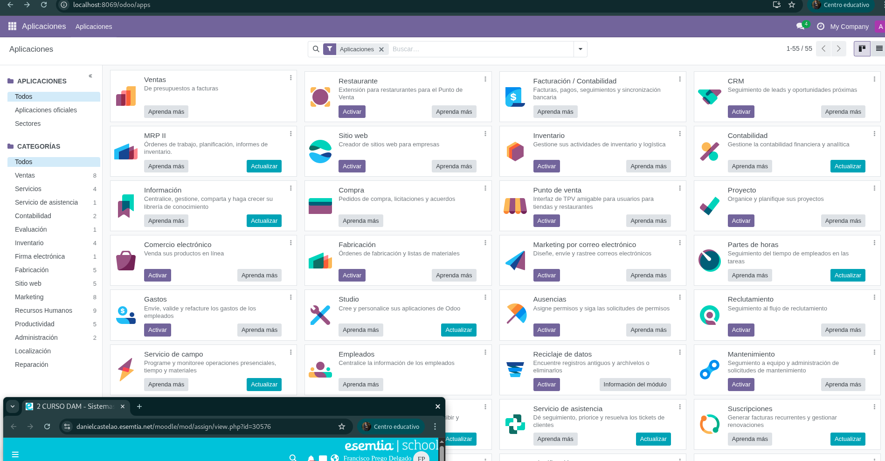
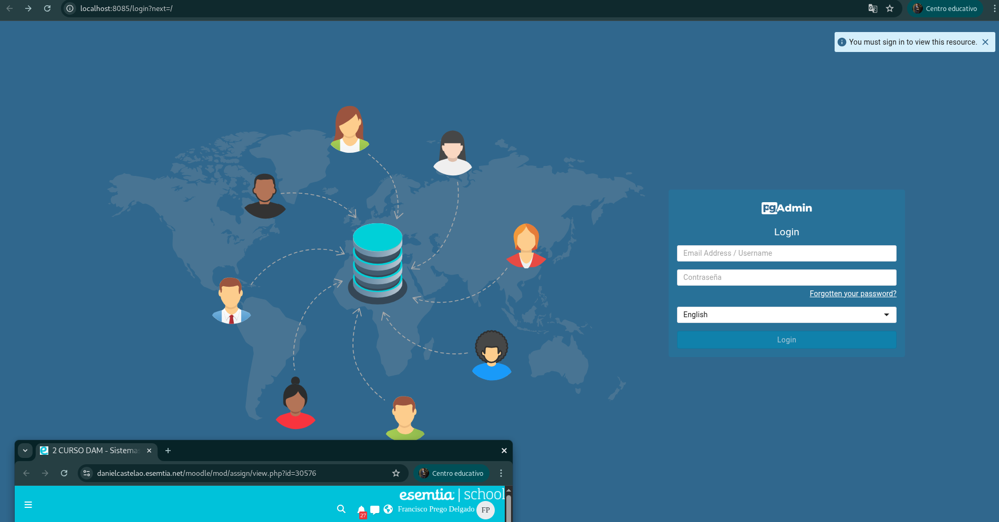
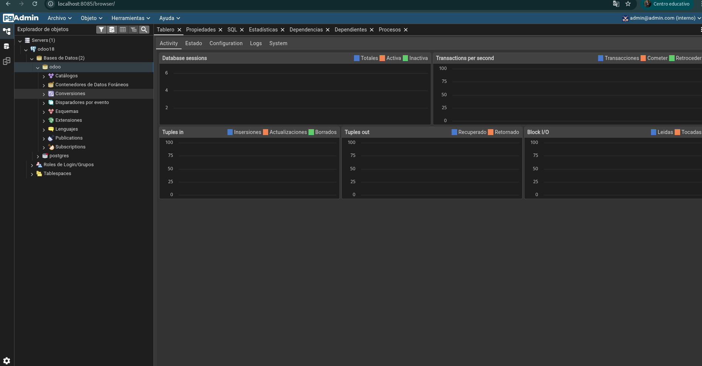

# Tarea_11_SXE

## PASO 1 : Instalamos nuestyro editor, en mi caso he escogidio PYCHARM
```bash
sudo snap install-community --classic
```
## PASO 2: Añadimos la extension de docker en nuestro editor:



## PASO 2: Para empezar creamos el .yml con el siguiente comando:  

```bash
nano docker-compose.yml
```
## yml: 




## PASO 2: Lanzamos el docker compose con el siguiente comando: 




## PASO 3: Una vez dentro, configuramos el odoo cubriendo los datos de gmail, usuario, contraseña e iniciamos sesion: 


## PASO 4: Al iniciar sesion entramos en la página inicial de Odoo. Una vez ahi, accedemos a las aplicaciones e instalamos algunos múdulos básicos, como Ventas, Compras o Contactos.



## PASO 5: Por otro lado, tenemos pgAdmin. Una vez que entreamos solo tenemos que poner nuestro usuario y contraseña para acceder a su página principal:



## PASO 6: Por último, dentro de pgAdmin agregamos un nuevo servidor y creamos una nueva base de datos. 


